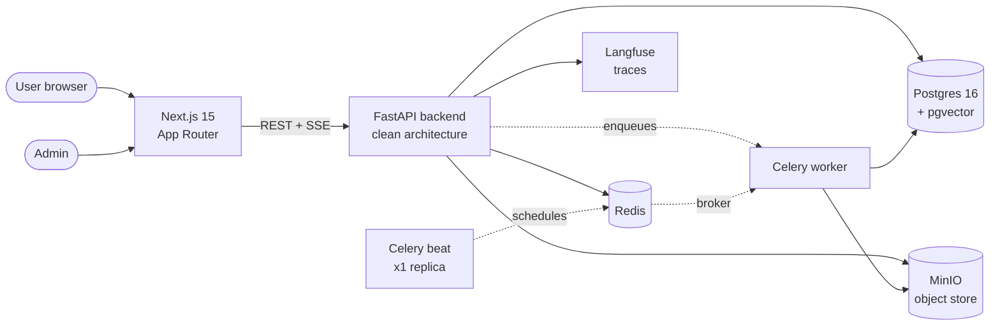

# Internal Knowledge AI Agent

A self-hosted, multi-stage RAG platform for internal knowledge. Admins register sources, users chat. The agent decides what to read, retrieves it, and answers with citations.

<!-- Hero screenshot: drop a clean admin-UI screenshot at docs/screenshots/hero.png
     (a path that is NOT gitignored) and uncomment the block below. The old
     docs/ReferenceImage/ folder is gitignored — conversation scratch only. -->
<!--
<p align="center">
  
</p>
-->

<p align="center">
  
  
  
  
  
  
  
</p>

---

## What it is

Most "chat with your docs" projects ship a single LLM call wrapped around a vector store. That works until your users start asking ambiguous questions, your sources span PDFs and Postgres, or you need to know *why* the agent answered the way it did.

**Internal Knowledge AI Agent** is what those projects grow into. It is a self-hosted admin platform that ingests documents, web pages, and live SQL databases into pgvector, then runs every chat message through a **10-node LangGraph pipeline** — input guard, clarification, query rewriting, source routing, vector retrieval *or* text-to-SQL, synthesis, output guard, optional self-critique, and persistence. Every LLM call is independently configurable per stage from an admin UI, and every call is traced in Langfuse.

It is built for engineering teams who need a defensible internal-knowledge assistant: clean architecture on the backend, a modern Next.js admin console, no SaaS lock-in, and the kind of observability you expect when an LLM sits between your users and your data.

## Features

- **10-node LangGraph pipeline** with two pipeline versions (v2 default, v1 30-second rollback) and an opt-in self-critic node
- **Three source types shipped end-to-end:** `file_upload` (PDF / DOCX / TXT / MD via MinIO), `database` (Postgres, async SQLAlchemy + SQL safety check), `web_url` (single-page fetch with SSRF guard against RFC1918, loopback, link-local, and cloud metadata)
- **Admin-configurable LLMs per stage** — set the model, temperature, max tokens, and custom prompt independently for `input_guard`, `clarification_detector`, `query_analyzer`, `source_router`, `text_to_query`, `synthesizer`, `output_guard`, and `reflector`
- **Embedder management** with a hard invariant: exactly one active embedder per deployment, enforced by partial unique index. Cross-embedder query mismatches are impossible.
- **Source studying agent** for database sources: introspects schemas, generates source descriptions, and feeds them into `text_to_query` SQL generation
- **Streaming answers via SSE** with inline citations hydrated from chunk metadata
- **Per-user source scoping** at the chat-session level; the router picks a subset of accessible sources per query
- **Account lockout** layered on per-IP rate limiting (sliding window, Redis-backed, fail-open or fail-closed configurable)
- **Langfuse observability** on every LLM call out of the box (self-hosted, no external traffic)
- **Celery + Redis** for async ingestion, with a single-replica Beat scheduler (duplicate beat = double-scheduling, enforced in compose)
- **Docker Compose deployment** — nine services, one command, no Kubernetes required

## Architecture



Inside the backend, every chat message flows through the LangGraph pipeline:

```
load_history → guardrail_input → check_clarification → query_analyzer → source_router
   ├─ retrieve_context  (pgvector cosine search)
   └─ text_to_query     (SQL generation for database sources)
                                                    ↓
        generate_response → [reflector?] → format_response → guardrail_output → persist
```

For a code-grounded walkthrough — which node lives in which file, what's wired vs aspirational, how citations are hydrated — read [`docs/agentic-system.md`](docs/agentic-system.md).

## Quick start

Prerequisites: Docker 24+, Docker Compose 2.24+.

```bash
git clone https://github.com/mohammad007kh/Internal-Knowledge-AI-Agent.git
cd Internal-Knowledge-AI-Agent
cp .env.example .env
cp backend/.env.example backend/.env
# Edit both .env files — at minimum set DB_PASSWORD, MINIO_SECRET_KEY,
# LANGFUSE_SECRET_KEY, JWT_SECRET_KEY, ENCRYPTION_KEY, and BOOTSTRAP_ADMIN_*
```

Start the stack:

```bash
docker compose up -d
```

The backend runs `alembic upgrade head` automatically on startup. When all health checks pass:

| Service        | URL                          |
| -------------- | ---------------------------- |
| Frontend       | http://localhost:3000        |
| Backend API    | http://localhost:8000        |
| API docs       | http://localhost:8000/docs   |
| Langfuse       | http://localhost:3001        |
| MinIO console  | http://localhost:9001        |

Log in at http://localhost:3000/login with the `BOOTSTRAP_ADMIN_EMAIL` and `BOOTSTRAP_ADMIN_PASSWORD` you set in `backend/.env`. Then:

1. Visit `/admin/ai-models` and add an LLM provider (OpenAI / Anthropic / etc.) and an embedder
2. Visit `/admin/llm-settings` and bind each of the eight LLM-using pipeline stages to a model
3. Visit `/admin/sources` and register a source (upload a PDF, add a database, or paste a URL)
4. Open `/chat`, scope the session to that source, and ask a question

## Configuration

All environment variables are documented in [`.env.example`](.env.example) (compose-scope) and [`backend/.env.example`](backend/.env.example) (application-scope). The most load-bearing ones:

| Variable                     | Purpose                                                                     |
| ---------------------------- | --------------------------------------------------------------------------- |
| `DATABASE_URL`               | Postgres connection string (`postgresql+asyncpg://...`)                     |
| `REDIS_URL`                  | Redis for cache, Celery broker, lockout, and sync-cancellation              |
| `JWT_SECRET_KEY`             | 256-bit secret for access tokens                                            |
| `JWT_REFRESH_SECRET_KEY`     | 256-bit secret for refresh tokens                                           |
| `ENCRYPTION_KEY`             | Fernet key for encrypting connector configs at rest                         |
| `BOOTSTRAP_ADMIN_EMAIL`      | First admin account (auto-created on startup)                               |
| `BOOTSTRAP_ADMIN_PASSWORD`   | First admin password                                                        |
| `LANGFUSE_PUBLIC_KEY` / `_SECRET_KEY` | Langfuse credentials for trace shipping                            |
| `PIPELINE_V2_ENABLED`        | `true` (default) for full 10-node pipeline; `false` for v1 rollback         |
| `PIPELINE_REFLECTOR_ENABLED` | `false` (default). Adds a self-critic LLM call per query when `true`        |
| `LOCKOUT_ENABLED`            | Layered account lockout on top of per-IP rate limiting                      |

Host ports can be shifted (`HOST_FRONTEND_PORT`, `HOST_BACKEND_PORT`, etc.) to avoid collisions with other projects on the same machine. Changing `HOST_BACKEND_PORT` or `HOST_MINIO_API_PORT` requires `docker compose build frontend` so Next.js re-inlines the public URLs at build time.

## Project structure

```
.
├── backend/
│   ├── src/
│   │   ├── agent/           # LangGraph pipeline + node implementations
│   │   ├── api/v1/          # FastAPI route handlers
│   │   ├── connectors/      # Source connectors (file, database, web_url, stubs)
│   │   ├── core/            # App factory, DI container, database, storage
│   │   ├── middleware/      # HTTP middleware (logging, security headers)
│   │   ├── models/          # SQLAlchemy ORM
│   │   ├── repositories/    # Data access layer
│   │   ├── schemas/         # Pydantic request/response models
│   │   ├── services/        # Business logic (AIModelResolver, sources, chat, ...)
│   │   ├── tasks/           # Celery task definitions
│   │   └── worker/          # Worker task implementations
│   ├── tests/{unit,integration}/
│   └── alembic/             # Schema migrations
├── frontend/
│   └── src/app/
│       ├── (admin)/         # /admin/* — sources, ai-models, llm-settings, users
│       ├── (auth)/          # /login, /setup, /password-reset, /change-password
│       └── (user)/          # /chat, /profile
├── docs/                    # Code-grounded docs (agentic-system, PRDs, design)
├── specs/                   # Atomic Spec governance artifacts
├── memory/constitution.md   # Non-negotiable architectural principles
├── docker-compose.yml       # 9-service stack
├── app_config.yaml          # Read-only app config mounted into containers
└── CLAUDE.md                # Project conventions for AI-assisted development
```

## Development

### Backend

```bash
cd backend
python -m venv .venv
source .venv/bin/activate         # Windows: .venv\Scripts\activate
pip install -e ".[dev]"
uvicorn src.main:app --reload --port 8000
```

### Frontend

```bash
cd frontend
pnpm install
pnpm dev
```

### Tests

```bash
# Backend
cd backend
pytest                                          # all
pytest tests/unit                               # unit only
pytest --cov=src --cov-report=term-missing      # with coverage (80% gate enforced in CI)

# Frontend
cd frontend
pnpm test:unit          # vitest
pnpm test:e2e           # playwright
```

CI runs the full suite on push and PR for `main` and `develop` (see [`.github/workflows/ci.yml`](.github/workflows/ci.yml)).

### Adding a feature

This project was built with the **[Atomic Spec](https://chappygo-os.github.io/Atomic-Spec/)** governance framework. New features go through four phases:

```
/atomicspec.specify  →  /atomicspec.plan  →  /atomicspec.tasks  →  /atomicspec.implement
```

Each phase produces structured artifacts under `specs/`, with mandatory human-in-the-loop checkpoints during planning. See [`CLAUDE.md`](CLAUDE.md) and the knowledge stations under `.specify/knowledge/stations/` for the full convention.

### Database migrations

```bash
cd backend
alembic revision --autogenerate -m "describe change"
alembic upgrade head
```

Migrations run automatically on backend container startup. Test downgrades locally:

```bash
docker compose exec backend alembic downgrade -1
docker compose exec backend alembic upgrade head
```

## Further reading

- [`docs/agentic-system.md`](docs/agentic-system.md) — how a chat message becomes an answer, node-by-node
- [`docs/ai-models-and-embedders-design.md`](docs/ai-models-and-embedders-design.md) — design doc for the LLM / embedder admin
- [`docs/PRD.md`](docs/PRD.md) — product requirements
- [Atomic Spec](https://chappygo-os.github.io/Atomic-Spec/) — the spec-driven governance framework this project was built with

## Contributing

Issues and pull requests are welcome.

Commits follow [Conventional Commits](https://www.conventionalcommits.org/):

```
feat(agent): add reflector node for self-critique
fix(sources): unify list-row DB strip with new lifecycle vocabulary
docs: rewrite README + repo polish recommendations
```

Types in use: `feat`, `fix`, `refactor`, `docs`, `test`, `chore`, `perf`, `ci`.

Before opening a PR:

- Tests pass locally (`pytest`, `pnpm test:unit`, `pnpm test:e2e`)
- Backend coverage is at or above 80% for changed code
- No hardcoded secrets — all secrets come from environment variables
- All user input is validated at the system boundary (Pydantic schema or Zod)

## License

[MIT](LICENSE) © 2026 Mohammad Khoddami.

---

<p align="center">
  Built with <a href="https://chappygo-os.github.io/Atomic-Spec/">Atomic Spec</a> — a spec-driven development governance framework.
</p>
